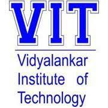
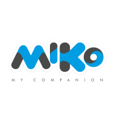
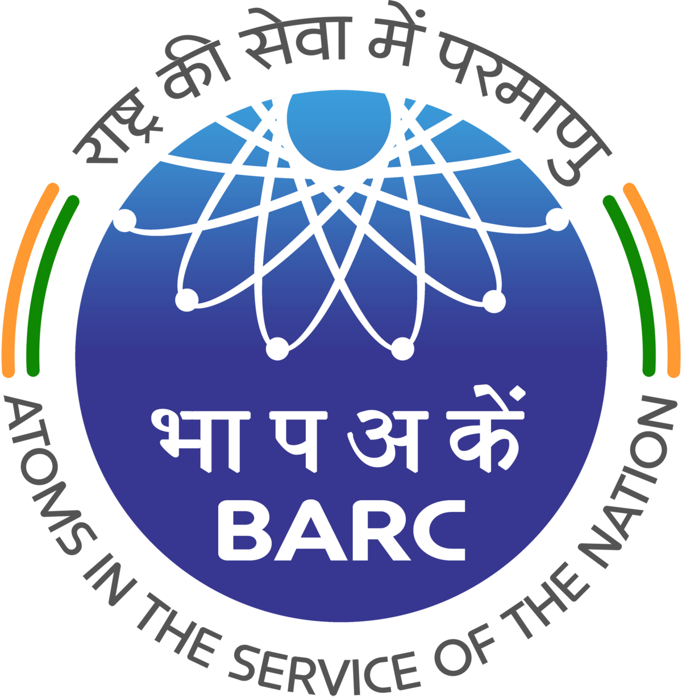

Hi, a little bit about myself, I am Aditi who is currently pursuing a Master's degree in Robotics at the University of Maryland. I am a robotics enthusiast with an incline towards path planning and control. I also hold a bachelor's degree in Electronics engineering.

I have worked in the industry as a firmware engineer for two years at a robotic company, [Miko](https://miko.ai/), working on module specific projects which included motion control, sensor integration and factory automation. In my undergrate years, I spent my time working on various projects that helped me learn a lot about the kind of technology currently being used in the industry. 

I am always excited to learn the new types of technologies being developed and used in the industry and how I can use them to develop my own work.

Oh, and also, I am heavily into hiking and playing tennis. Hit me up if you want to talk sports, robotics, automation, or anything fun in life! :)

# Education
======

**Master of Engineering (MEng) in Robotics, [University of Maryland-College Park](https://www.umd.edu/)**
#### August 2021 - Present | Maryland, USA
I am currently pursuing my Graduate Degree in Robotics from the University of Maryland with a focus in Path planning and perception.    

<strong>coursework:</strong>
* <strong>Fall '21: </strong>Robot control, Robot modelling, Software Development  

-----

**Bachelor of Technology (B.Tech) in Electronics, [University of Mumbai](https://mu.ac.in/)**
#### August 2015 - June 2019 | Mumbai, India

-----
I completed my Undergraduate Degree in Electronics from the University of Mumbai - Vidyalankar Institue of Technology in 2019.    
<strong>CGPA:</strong> 3.7/4.0   
<strong>Coursework:</strong> Control Systems, Embedded System Design, Digital Image Processing, Computer Organization and Architecture,
Discrete Time Signal Processing, Microcontroller Microprocessor and Applications, Applied Mathematics, Object Oriented
Programming  
 

# Experience
-----

**Firmware Engineer, [Miko](https://miko.ai/)** 
#### August 2019 - July 2021 | Mumbai, India
----- 
* Automated factory line testing process using RaspberryPi, C++ and python, resulting in a reduction of manpower and acceleration
of the process by dropping all the way down to 25 seconds from roughly 10 minutes per robot.
* Accelerated the robot factory packaging line using an inventory check method for scanning and printing barcode labels for the
package using VBA to achieve higher efficiency and quicker rollouts.
* Developed a fault detection module on STM32 for detecting huge impacts and falls of the robot in real-time as a feature to
determine the cause of failure in case of non-functionality, increased accuracy by 80%, and dependency on module raised to 50%.
* Designed compact and power-efficient PCBs for hardware testing platforms of the robot using Eagle resulting in enhanced
extensive capabilities of quality testing of the functionality of each part in the robot.

-----

**Control Systems Engineer, [Bhabha Atomic Reseach Center](http://www.barc.gov.in/)** 
#### June 2018 - April 2019 | Mumbai, India
----- 
* Conceptualized and optimized a design for Autonomous Closed Loop Control of Three-Phase Inductor using PID control and IGBT
inverter with Voltage to Frequency Ratio Control for better efficiency and accurate control.
* Executed V/F control on the same using FPGA development board through Verilog code to achieve the simulated results in the real world.

# Key Skills
----
* <strong> Programming Languages: </strong> Python, C++, VBA, Verilog, HTML  
* <strong> Operating Systems: </strong> Windows, Linux, Ubuntu  
* <strong> Libraries: </strong> Numpy, Pandas, Eigen, Matplotlib, Scikit-learn, OpenCV  
* <strong> Tools: </strong> ROS, Gazebo, Simulink, Matlab  
  
----