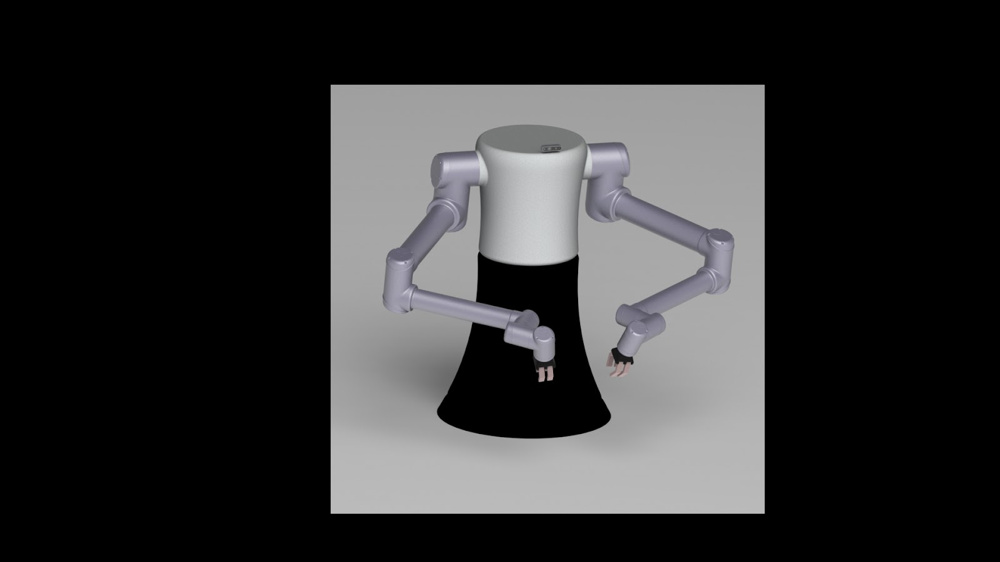
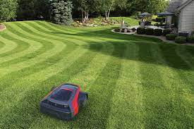
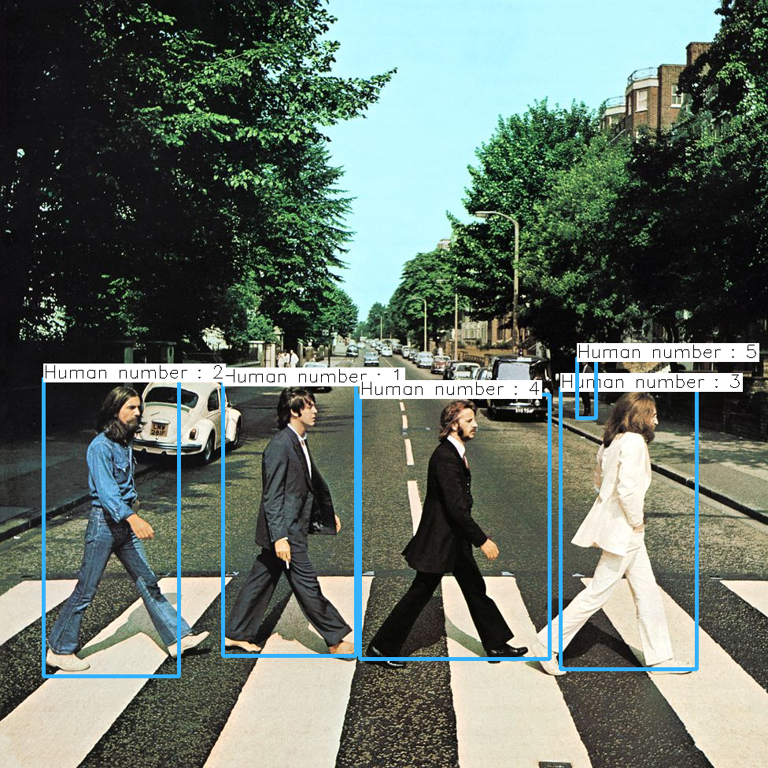

-----

**Food Automation, Food Maker Robot**
#### December 2021 | Maryland, USA

-----

**Consumer Automation, Autonomous Lawn Mower**
#### November 2021- December 2021 | Maryland, USA

-----
* Developed and deployed a ROS package with a functionality of autonomous navigation for a lawn mower.
* Implemented on a turtlebot3 using the navigation stack of ROS. 
* Designed a user interface for the added ability of controlling the robot in special cases  

Here is the - [Github Repo](https://github.com/aditiramadwar/Autonomous_Lawn_Mower/)

-----
* Developed a food making robot which can add various toppings on a pizza base
* Designed the entire model of the robot as well as analyse the kinematics of the entire robot as per usecase.
* Simulation was done on Gazebo using ROS.

Here is the - [Github Repo](https://github.com/aditiramadwar/food_maker)

-----

**Computer Vision, Human Detector**
#### Octorber 2021 | Maryland, USA

-----
* Module for detecting humans using Yolov3 and OpenCV
* It is able to quicky detect the humans in frame and provide each human with a unique ID
* It is also able to accurately provide the location of the human in frame with respect to the robot's frame of reference.  

Here is the - [Github Repo](https://github.com/aditiramadwar/Human_Detection_Tracking-CPP/)

-----

**Food Automation, Automatic Restaurant Menu ordering System**
#### February 2020 - March 2020 | Mumbai, India

-----
* Implemented an embedded communication system using RF modules for transmitting menu order of customer directly to the chef.
* Generated a simulation of the same on Proteus and also designed  

Here is the - [Github Repo](https://github.com/aditiramadwar/Automatic-Restaurant-Menu-Ordering-System)
